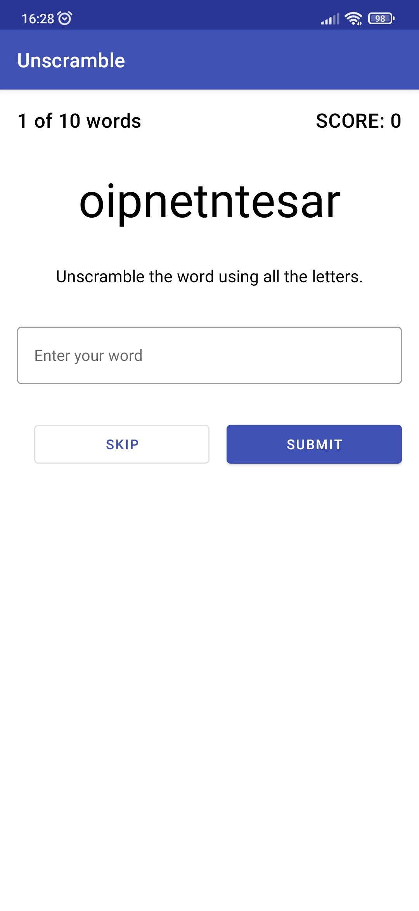
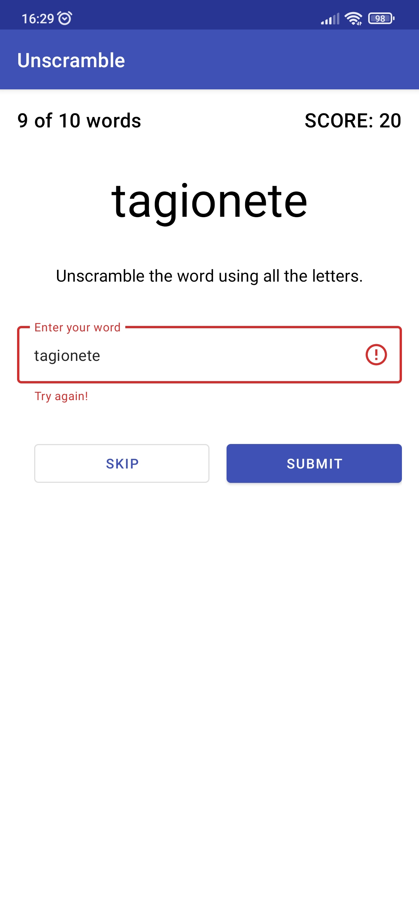
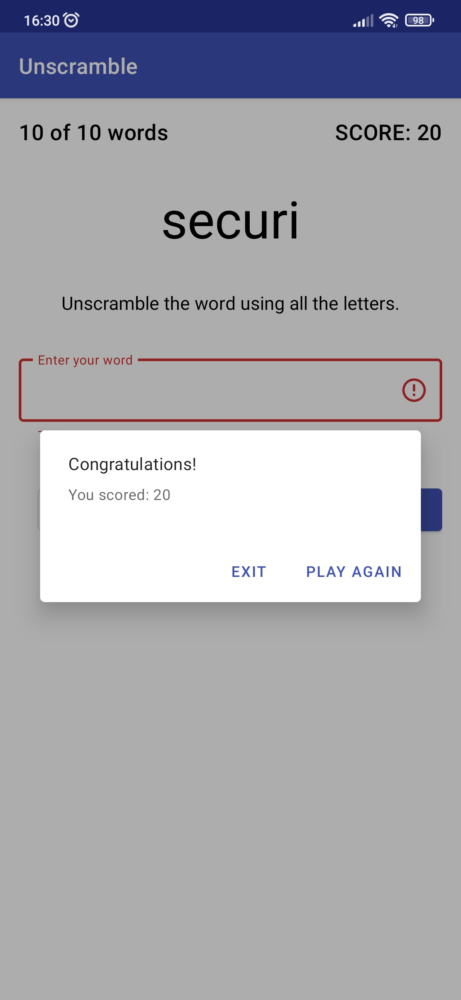

# Unscramble App

This is a simple unscramble game for Android that was created as part of
course [Android Basics in Kotlin](https://developer.android.com/courses/android-basics-kotlin/course)
by Google.

## Table of contents

- [How does it work](#How-does-it-work)
- [Screenshots](#Screenshots)
- [Technologies](#Technologies)
- [Development progress](#Development-progress)
- [Project statistics](#Project-statistics)
- [How to install](#How-to-install)
- [How to contribute](#How-to-contribute)

## How does it work

The user sees the letters from which the word needs to be composed. If the answer is correct, then
the user gets 20 points. If the answer is incorrect, the user sees a warning and can change the
answer or skip the question. After 10 questions, the user sees the result.

## Screenshots

*All screenshots are relevant for version 1.0*

At the beginning:

After click on the "SUBMIT" button with an incorrect answer:

At the end of the game:

## Technologies

- The programming
  language [Kotlin](https://kotlinlang.org/) ([AdoptOpenJDK version 11.0.10](https://adoptopenjdk.net/))
  was chosen for development.

- Development was carried out in [Android Studio](https://developer.android.com/studio/).

- [Figma](https://www.figma.com/) was used to prototype the user interface.

- [WakaTime](https://wakatime.com/) was used to track activity.

- [Microsoft To Do](https://todo.microsoft.com/tasks/) was used to schedule tasks.

## Development progress

Development of the project began on **September 20, 2021** and completed on **September 21, 2021**.

*Since I am developing this project mainly alone, I see no reason to
use [Trello](https://trello.com/).*

## Project statistics

See more on [WakaTime](https://wakatime.com/@VitasSalvantes/projects/obvoxhjimc).

## How to install

1. Download the repository code as a zip archive
2. Unpack the zip archive
3. Open the unpacked project with Android Studio
4. Run the project

## How to contribute

The project was created as part of
course [Android Basics in Kotlin](https://developer.android.com/courses/android-basics-kotlin/course)
by Google and does not provide for contribution.
